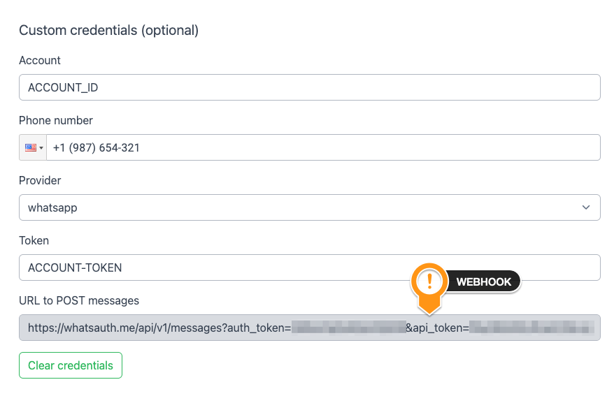
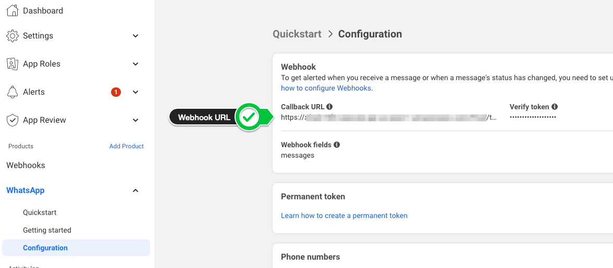
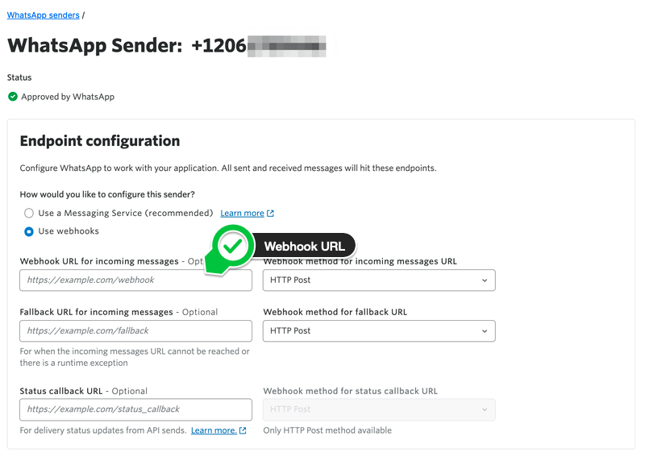

# Can I use my own WhatsApp Number?

Sure!

When you want to keep the branding of your service intact you can use your own WhatsApp account.

You can set up your credentials from your Meta or Twilio account in the App configuration.

**Custom Credential Form**
{: .text-center }

Here you can get the URL of the WhatsAuth endpoint to your App in order to be set on the WhatsApp provider webhook URL.

This URL must be set in a WhatsApp number whose only purpose is the validation using WhatsAuth because any message not matching the WhatsAuth format will be dismissed.  

In Meta, you should use your API_TOKEN as a verification token.

**Meta Callback URL**
{: .text-center }

**Twilio Callback URL**
{: .text-center }

