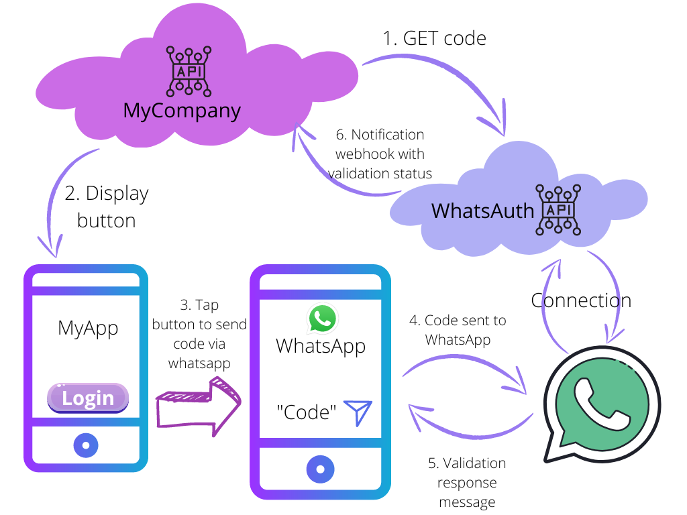

# How it works
WhatsAuth provides a simple and reliable way to validate mobile phone numbers and authorize several kinds of transactions such as OTP, 2-Factor Authentication, Delivery proof, etc.

We create a unique disposable code for each transaction that you require to validate by a mobile phone number using WhatsApp Application. 

The code is validated or disposed once its purpose is fulfilled or expired while keeping you or your platform informed of any changes in its status allowing you to react at your convenience.

Usage Flow

