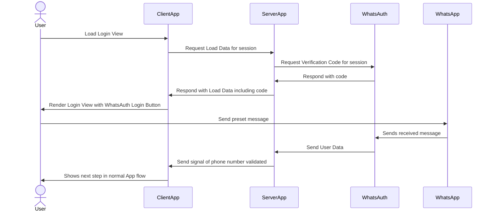

# How to use WhatsApp as a login provider in your Web or App
If you want to enable login with WhatsApp in your site or app you can do it by following this simple guide. We suggest you refresh your understanding of the [general usage](/faq/how-it-works.md) flow to get the most out of this guide.

{: .highlight }
This is just one option to implement the WhatsApp Login with WhatsAuth. There are several other vays to accomplish this purpose. Please don't hesitate in contacting support if you have any doubt.

## Requirements

1.  A Valid API Token from a [WhatsAuth App](/guides/how-to-create-your-first-app-in-whatsauth-and-test-it.html). For instance "SUPERSECRETTOKEN"
2.  A user session identifier within your platform. It could be a uuid "ace9b0d1-bdaa-4a56-8b28-94ad8d6d0f6b"
3.  A backend endpoint to receive POST requests. Let's assume you have enabled "https://mycompany.com/webhooks/whatsauth"

## Step-by-step Guide

### Sequence Diagram



### Get a Unique Code for a User

Every time a user gets to arrive at your login view you need to ask for a unique verification code in WhatsAuth. This could be done by the server or the client. 

In order to get a code you must perform an HTTPS GET request to this endpoint:

  

https://whatsauth.me/api/v1/verification\_code

  

This request should be authenticated using your API token a _Bearer_ in the header "Authorization". So far, so simple.

The clever part, of this code you are requesting, is that you will pass the session identifier as a parameter of the callback URL as follows:

  

https://mycompany.com/webhook/whatsauth?<mark>session_id=ace9b0d1-bdaa-4a56-8b28-94ad8d6d0f6b</mark>

  

This little trick allows your platform to easily match a profile with the user session that is attempting to log in.

In the end, your request would be something like this:

  
```bash
    curl -G \
    --location 'https://whatsauth.me/api/v1/verification_code' \
    --data-urlencode 'callback_url=https://mycompany.com/webhook/whatsauth?session_id=ace9b0d1-bdaa-4a56-8b28-94ad8d6d0f6b' \
    --header 'Authorization: Bearer SUPERSECRETTOKEN'
```

  

### Showing the Login Button

Once you make the previous request you'll get a response in JSON format containing a **link** and a **deep\_link** that triggers the same unique WhatsApp message related to that **sessiond\_id**. It's up to you to choose which format to expose as a button according to your app or website.

  
```json
    {
        "code": "322c9a59dd",
        "link": "https://wa.me/+56943426553?text=%3E%3E322c9a59dd%3C%3C%0AJust%20tap%20the%20%22send%22%20button.",
        "deep_link": "whatsapp://send?text=%3E%3E322c9a59dd%3C%3C%0AJust%20tap%20the%20%22send%22%20button.&phone=+56943426553"
    }
```

The button will be clicked or tapped by the user, then the WhatsApp app will open with the preloaded message ready to be sent.

  

### Receiving the Webhook

Once the user sends the message the specified **callback\_url** will be requested with a POST. Since you included a **session\_id** in the **callback\_url**:

  

https://mycompany.com/webhook/whatsauth?session\_id=ace9b0d1-bdaa-4a56-8b28-94ad8d6d0f6b

  
```json
    {
       "id": "123e4567-e89b-12d3-a456-426614174000",
       "status": "validated",
       "verification_code": "9f76681bd4",
       "phone_number": "+1234567890",
       "profile_name": "John Doe",
       "expires_at": "2021-01-27T01:17:13.674Z",
       "requested_at": "2021-01-26T23:17:13.674Z",
       "validated_at": "2021-01-26T23:23:17.28Z",
       "authorized_numbers": [],
       "error": null
    }
```


your service should parse the **session\_id** from the URL in order to match the session with the data of the received JSON.

This way you can be **sure** that the user with the **session\_id**: ace9b0d1-bdaa-4a56-8b28-94ad8d6d0f6b is the one with:

**profile\_name**: John Doe and **phone\_number**: +1234567890.

  

### Update User's Data In Your App

Alright! You have all the valuable data already, just the final step is to go ahead with your app flow, setting the user as a logged-in one. You can have an internal websocket service or a polling endpoint that refreshes the data linked to the **session\_id**, hence, the front or backend can get the user profile information.

  

And that's it! a super simple and reliable flow that allows your user to forget about passwords and you get a super secure authentication system.